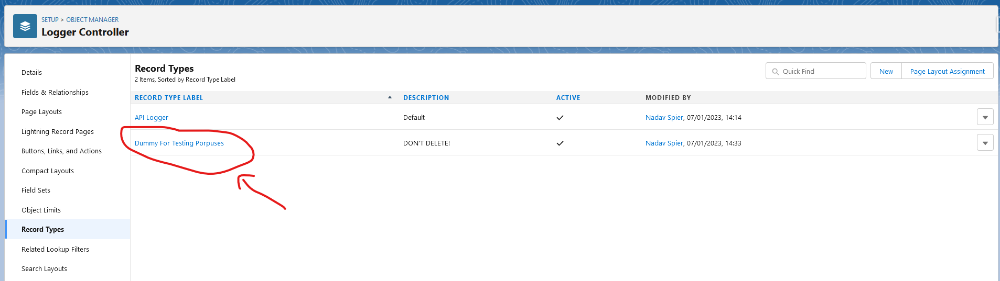
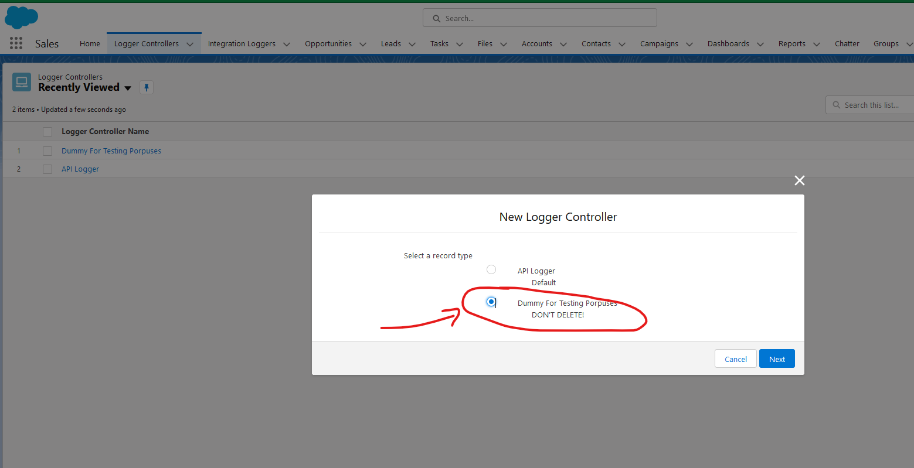
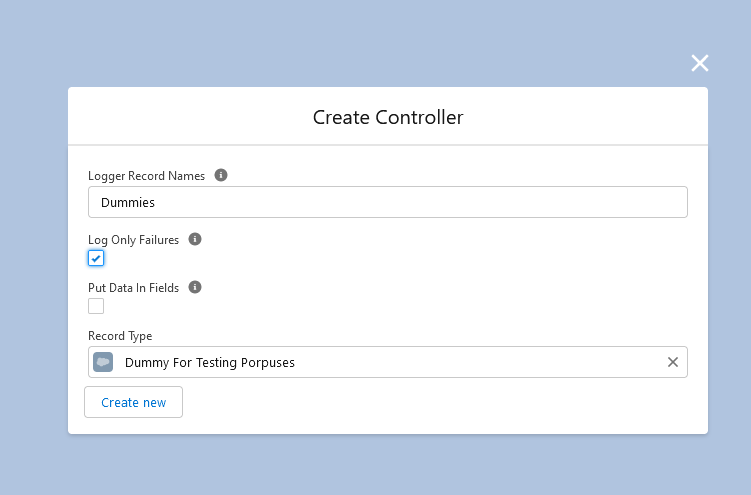
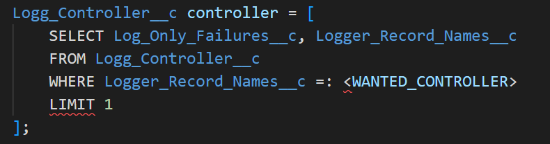
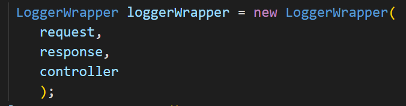
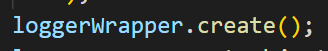

# Integrations Loger

A brief description of what this project does and who it's for

## Deployment

To deploy this project run

```bash

```

## Salesforce Admin
1. Create Controller RecordType:
    (each intagraton must have his own unique RecordType!)
    
2. Create Controller
    - 

    - 

3. Ask developer in insert needed code to start logging.


## Developer
1. Query/Create wanted 'Controller':


2. Call the 'Logger Wrapper' constructor.
    - Be sure to give it the apropriate:
        - HTTPRequest
        - HTTPResponse
        - 'Logger Controller'


3. Call the 'create' function (this will insert the 'log' record to the DB).
