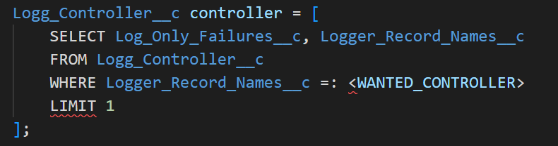
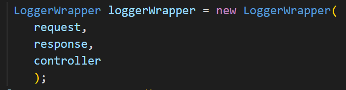
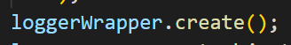

# READEME

## Code
1. Query/Create wanted 'Controller':

2. Call the 'Logger Wrapper' constructor.
    - Be sure to give it the apropriate:
        - HTTPRequest
        - HTTPResponse
        - 'Logger Controller'

3. Call the 'create' function (this will insert the 'log' record to the DB).
